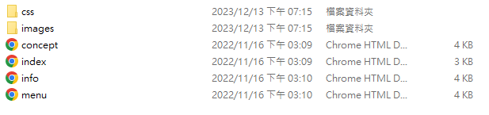
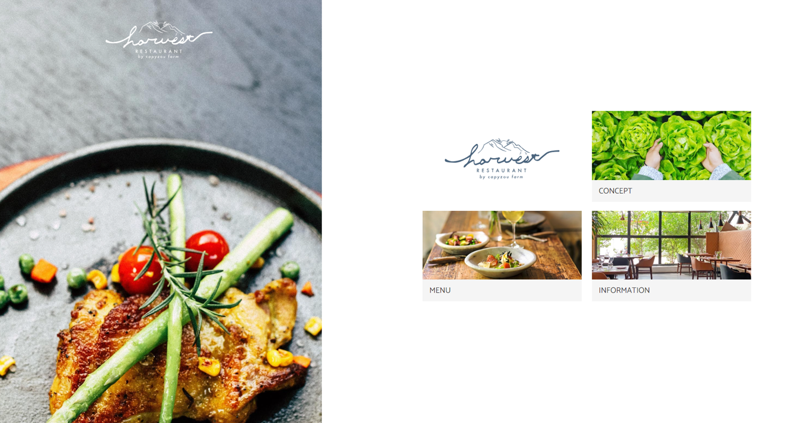
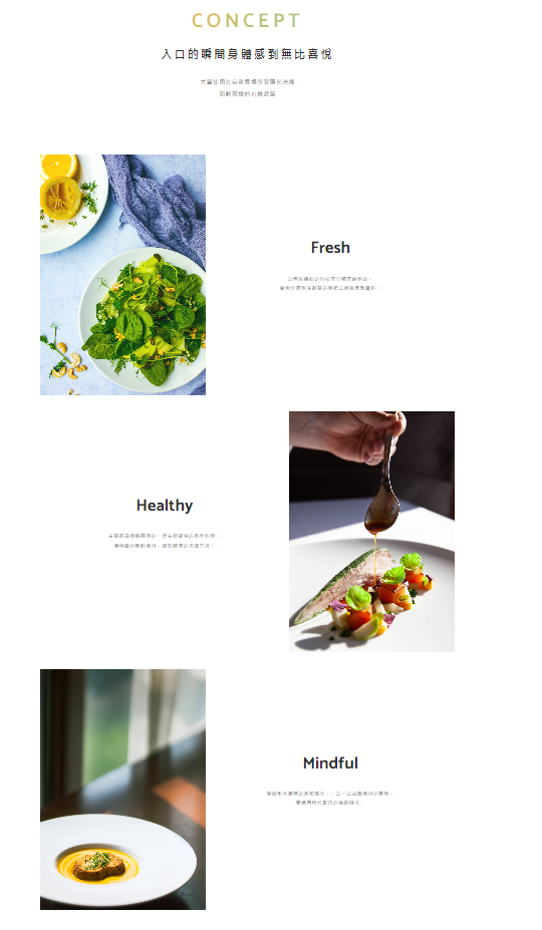
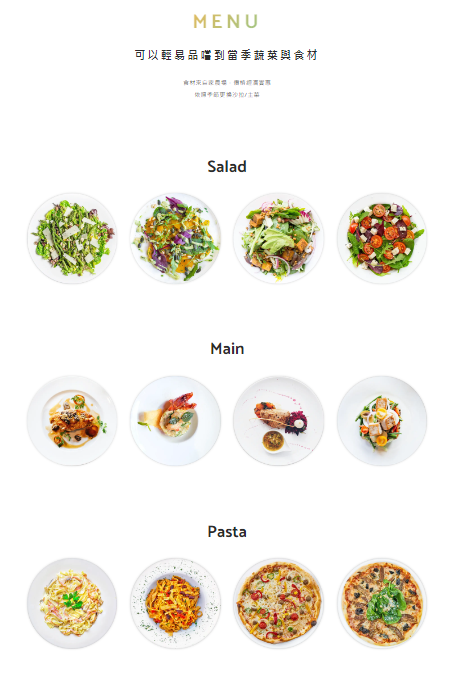
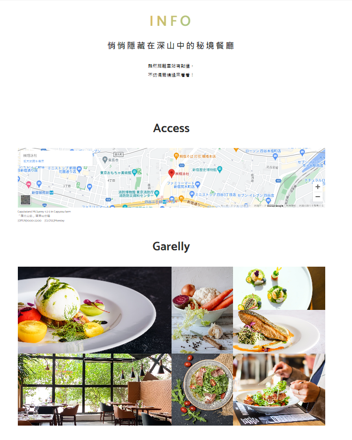

# 網站架構


# 網站設計結構
## 首頁index.html


##  concept.html

## menu.html

## info.html



## 首頁index.html
```html
<!DOCTYPE html>
<html lang="zh-Hant-TW">
  <head>
    <meta charset="UTF-8">
    <meta name="viewport" content="width=device-width,initial-scale=1">
    <link rel="stylesheet" href="css/reset.css">
    <link rel="preconnect" href="https://fonts.gstatic.com">
    <link rel="stylesheet" href="https://fonts.googleapis.com/css2?family=Catamaran:wght@400;700&family=Noto+Sans+TC:wght@400;700&display=swap">
    <link rel="stylesheet" href="css/style.css">
    <link rel="icon" href="images/favicon.svg" type="image/svg+xml">
    <link rel="icon alternate" href="images/favicon.png" type="image/png">
    <meta property="og:type" content="website">
    <meta property="og:url" content="https://example.com/">
    <meta property="og:site_name" content="Harvest Restaurant">
    <meta property="og:title" content="Harvest Restaurant">
    <meta property="og:description" content="悄悄隱藏在深山中的秘境餐廳">
    <meta property="og:image" content="https://example.com/images/ogp.png">
    <meta property="og:image:alt" content="Harvest Restaurant">
    <meta property="og:image:width" content="1200">
    <meta property="og:image:height" content="630">
    <title>Harvest Restaurant</title>
  </head>
  <body class="topPage">
    <header>
      <h1>
        
      </h1>
      <nav class="gMenu">
        <input class="menu-btn" type="checkbox" id="menu-btn">
        <label class="menu-icon" for="menu-btn">
          <span class="navicon"></span>
        </label>
        <ul class="menu">
          <li><a href="index.html">home</a></li>
          <li><a href="concept.html">concept</a></li>
          <li><a href="menu.html">menu</a></li>
          <li><a href="info.html">info</a></li>
        </ul>
      </nav>
    </header>
    <main>
      <ul class="linkList">
        <li>
          <a href="concept.html">
            
            <span>CONCEPT</span>
          </a>
        </li>
        <li>
          <a href="menu.html">
            
            <span>MENU</span>
          </a>
        </li>
        <li>
          <a href="info.html">
            
            <span>INFORMATION</span>
          </a>
        </li>
      </ul>
    </main>
  </body>
</html>
```
##
```html

```
##  concept.html
```html
<!DOCTYPE html>
<html lang="zh-Hant-TW">
  <head>
    <meta charset="UTF-8">
    <meta name="viewport" content="width=device-width,initial-scale=1">
    <link rel="stylesheet" href="css/reset.css">
    <link rel="preconnect" href="https://fonts.gstatic.com">
    <link rel="stylesheet" href="https://fonts.googleapis.com/css2?family=Catamaran:wght@400;700&family=Noto+Sans+TC:wght@400;700&display=swap">
    <link rel="stylesheet" href="css/style.css">
    <link rel="icon" href="images/favicon.svg" type="image/svg+xml">
    <link rel="icon alternate" href="images/favicon.png" type="image/png">
    <meta property="og:type" content="website">
    <meta property="og:url" content="https://example.com/concept.html">
    <meta property="og:site_name" content="Harvest Restaurant">
    <meta property="og:title" content="Harvest Restaurant">
    <meta property="og:description" content="悄悄隱藏在深山中的秘境餐廳">
    <meta property="og:image" content="https://example.com/images/ogp.png">
    <meta property="og:image:alt" content="Harvest Restaurant">
    <meta property="og:image:width" content="1200">
    <meta property="og:image:height" content="630">
    <title>CONCEPT | Harvest Restaurant</title>
  </head>
  <body class="subPage">
    <header>
      <h1>
        <span>concept</span>
      </h1>
      <nav class="gMenu">
        <input class="menu-btn" type="checkbox" id="menu-btn">
        <label class="menu-icon" for="menu-btn">
          <span class="navicon"></span>
        </label>
        <ul class="menu">
          <li><a href="index.html">home</a></li>
          <li><a href="concept.html">concept</a></li>
          <li><a href="menu.html">menu</a></li>
          <li><a href="info.html">info</a></li>
        </ul>
      </nav>
    </header>
    <main>
      <section>
        <h2>入口的瞬間<br class="onlySP">身體感到無比喜悅</h2>
        <p class="lead">
          大量使用在自家農場享受陽光洗禮<br>
          新鮮現摘的有機蔬菜
        </p>
        <section class="conceptDetailSec">
          <h3>Fresh</h3>
          <p class="photo">
            
          </p>
          <p class="text">
            以色彩繽紛的沙拉充分補充維他命。<br>
            享用早晨現採蔬菜的爽脆口感與自製醬料。
          </p>
        </section>
        <section class="conceptDetailSec reverse">
          <h3>Healthy</h3>
          <p class="photo">
            
          </p>
          <p class="text">
            主菜是由廚藝精湛的一流主廚提供的創作料理。<br>
            使用當地新鮮食材，講究健康的烹調方法。
          </p>
        </section>
        <section class="conceptDetailSec">
          <h3>Mindful</h3>
          <p class="photo">
            
          </p>
          <p class="text">
            穿透樹木灑落的柔和陽光，一口一口品嚐食材的美味。<br>
            度過有別於都市的恬靜時光。
          </p>
        </section>
      </section>
    </main>
    <footer>
      <p>
        
      </p>
    </footer>
  </body>
</html>
```

## info.html
```html
<!DOCTYPE html>
<html lang="zh-Hant-TW">
  <head>
    <meta charset="UTF-8">
    <meta name="viewport" content="width=device-width,initial-scale=1">
    <link rel="stylesheet" href="css/reset.css">
    <link rel="preconnect" href="https://fonts.gstatic.com">
    <link rel="stylesheet" href="https://fonts.googleapis.com/css2?family=Catamaran:wght@400;700&family=Noto+Sans+TC:wght@400;700&display=swap">
    <link rel="stylesheet" href="css/style.css">
    <link rel="icon" href="images/favicon.svg" type="image/svg+xml">
    <link rel="icon alternate" href="images/favicon.png" type="image/png">
    <meta property="og:type" content="website">
    <meta property="og:url" content="https://example.com/info.html">
    <meta property="og:site_name" content="Harvest Restaurant">
    <meta property="og:title" content="Harvest Restaurant">
    <meta property="og:description" content="悄悄隱藏在深山中的秘境餐廳">
    <meta property="og:image" content="https://example.com/images/ogp.png">
    <meta property="og:image:alt" content="Harvest Restaurant">
    <meta property="og:image:width" content="1200">
    <meta property="og:image:height" content="630">
    <title>INFO | Harvest Restaurant</title>
  </head>
  <body class="subPage">
    <header>
      <h1>
        <span>info</span>
      </h1>
      <nav class="gMenu">
        <input class="menu-btn" type="checkbox" id="menu-btn">
        <label class="menu-icon" for="menu-btn">
          <span class="navicon"></span>
        </label>
        <ul class="menu">
          <li><a href="index.html">home</a></li>
          <li><a href="concept.html">concept</a></li>
          <li><a href="menu.html">menu</a></li>
          <li><a href="info.html">info</a></li>
        </ul>
      </nav>
    </header>
    <main>
      <section>
        <h2>悄悄隱藏在深山中的<br class="onlySP">秘境餐廳</h2>
        <p class="lead">
          雖然距離車站有點遠，<br>
          不妨偶爾繞過來看看！
        </p>
        <section>
          <h3>Access</h3>
          <p class="map">
            <iframe src="https://www.google.com/maps/embed?pb=!1m14!1m8!1m3!1d2381.3378364030896!2d139.72054154511156!3d35.68929551223065!3m2!1i1024!2i768!4f13.1!3m3!1m2!1s0x0%3A0x5c1e99747ec1e94e!2z77yI5qCq77yJ57-U5rOz56S-!5e0!3m2!1sja!2sjp!4v1617701157289!5m2!1sja!2sjp" width="800" height="600" style="border:0;" allowfullscreen="" loading="lazy"></iframe>
            Capybaland Mt.Sunny 1-2-3 in Capyzou farm<br>
            「陽光山站」開車10分鐘<br>
            [OPEN]10:00-22:00　[CLOSE]Monday
          </p>
        </section>
        <section>
          <h3>Garelly</h3>
          <ul class="photoGarelly">
            <li class="item01"></li>
            <li class="item02"></li>
            <li class="item03"></li>
            <li class="item04"></li>
            <li class="item05"></li>
            <li class="item06"></li>
            <li class="item07"></li>
          </ul>
        </section>
      </section>
    </main>
    <footer>
      <p>
        
      </p>
    </footer>
  </body>
</html>
```
## menu
```html
<!DOCTYPE html>
<html lang="zh-Hant-TW">
  <head>
    <meta charset="UTF-8">
    <meta name="viewport" content="width=device-width,initial-scale=1">
    <link rel="stylesheet" href="css/reset.css">
    <link rel="preconnect" href="https://fonts.gstatic.com">
    <link rel="stylesheet" href="https://fonts.googleapis.com/css2?family=Catamaran:wght@400;700&family=Noto+Sans+TC:wght@400;700&display=swap">
    <link rel="stylesheet" href="css/style.css">
    <link rel="icon" href="images/favicon.svg" type="image/svg+xml">
    <link rel="icon alternate" href="images/favicon.png" type="image/png">
    <meta property="og:type" content="website">
    <meta property="og:url" content="https://example.com/menu.html">
    <meta property="og:site_name" content="Harvest Restaurant">
    <meta property="og:title" content="Harvest Restaurant">
    <meta property="og:description" content="悄悄隱藏在深山中的秘境餐廳">
    <meta property="og:image" content="https://example.com/images/ogp.png">
    <meta property="og:image:alt" content="Harvest Restaurant">
    <meta property="og:image:width" content="1200">
    <meta property="og:image:height" content="630">
    <title>MENU | Harvest Restaurant</title>
  </head>
  <body class="subPage">
    <header>
      <h1>
        <span>menu</span>
      </h1>
      <nav class="gMenu">
        <input class="menu-btn" type="checkbox" id="menu-btn">
        <label class="menu-icon" for="menu-btn">
          <span class="navicon"></span>
        </label>
        <ul class="menu">
          <li><a href="index.html">home</a></li>
          <li><a href="concept.html">concept</a></li>
          <li><a href="menu.html">menu</a></li>
          <li><a href="info.html">info</a></li>
        </ul>
      </nav>
    </header>
    <main>
      <section>
        <h2>可以輕易品嚐到<br class="onlySP">當季蔬菜與食材</h2>
        <p class="lead">
          食材來自家農場，價格經濟實惠<br>
          依照季節更換沙拉/主菜
        </p>
        <section class="menuDetailSec">
          <h3>Salad</h3>
          <ul class="menuList">
            <li></li>
            <li></li>
            <li></li>
            <li></li>
          </ul>
        </section>
        <section class="menuDetailSec">
          <h3>Main</h3>
          <ul class="menuList">
            <li></li>
            <li></li>
            <li></li>
            <li></li>
          </ul>
        </section>
        <section class="menuDetailSec">
          <h3>Pasta</h3>
          <ul class="menuList">
            <li></li>
            <li></li>
            <li></li>
            <li></li>
          </ul>
        </section>
      </section>
    </main>
    <footer>
      <p>
        
      </p>
    </footer>
  </body>
</html>
```
